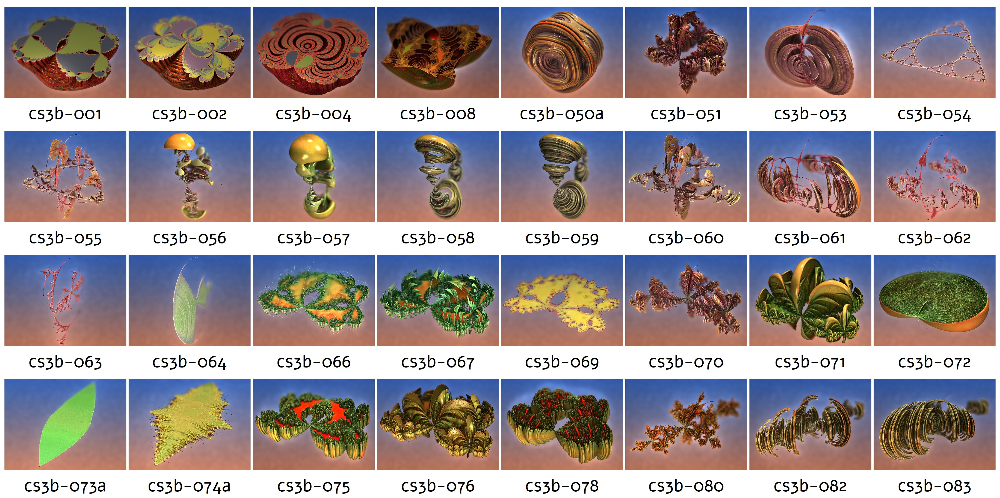
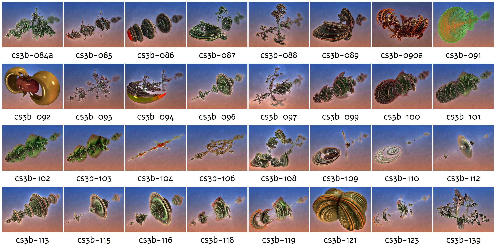

# Showcase of one specific formula

This folder shares the data for an overview over the **purely used** formula JIT_gnj_RealPowNewtCS_3b.m3f, as shared originally in Fractalforums, specifically in the entries   
https://fractalforums.org/image-threads/25/terra-newtonia/3963/msg29510#msg29510 and   
https://fractalforums.org/image-threads/25/terra-newtonia/3963/msg29511#msg29511   
   
Older 3D Newton formulas are less easy to be used as stand-alone formula, and should be used hybridized with other formulas.   
But this formula can well be used pure, without any hybrids.   
   
**Note:**    
To simplify the naming and potential further development will be in formulas called JIT_gnj_RealPowNewt**P**\_\*.m3f   
The **P** stands for _pretransform_ . The formula _can_ be used as stand-alone formula, but different values of solution, and the c in z^n+c don't introduce anything new (at least not without much on effort), and makes configuration difficult.   
Therefore a new, simplified variant has been introduced called JIT_gnj_RealPowNewt**E** (**E** for _easy_).   
The **P** variants are mainly intended to be used as pretransform, since they can make nice distortions, mainly due to the combination of inversion, and power. In that case you can use the _solution_ parameters without distraction.   
   
Any recent variants see at [/formulas-jit/Newton3D/](/formulas-jit/Newton3D/)   
   
Overview, part 1a:   
   
   
Overview, part 1b:   
   
